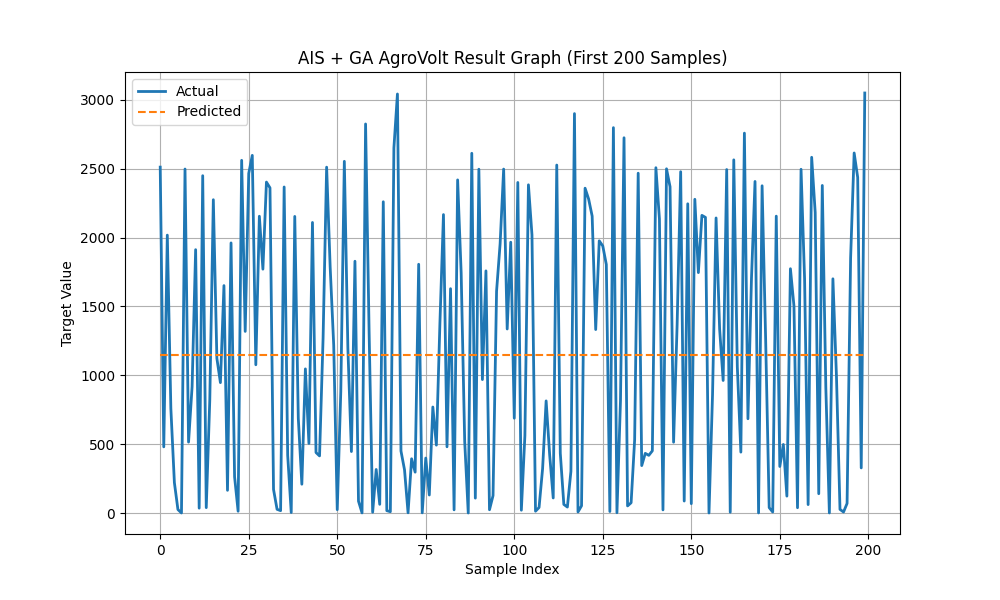

🌞 AgroVolt — Smart Solar-Powered Irrigation & Soil Optimization System.
🔬 Hybrid AIS + GA Optimized CNN-LSTM Model.
📘 Overview-

AgroVolt is an AI-driven irrigation and solar-energy management platform designed for precision agriculture.
It intelligently coordinates soil moisture, weather, and solar availability to optimize irrigation scheduling and energy usage — powered entirely by clean solar energy.

This version integrates a Hybrid Artificial Immune System (AIS) and Genetic Algorithm (GA) to automatically fine-tune deep-learning model parameters, achieving maximum prediction accuracy for real-time irrigation decisions.

🧩 Key Features

🌱 Hybrid AIS + GA Optimization — Combines exploration and exploitation for robust hyper-parameter tuning.

⚙️ CNN-LSTM Architecture — Learns spatio-temporal soil–solar patterns.

🔆 Energy-Aware Predictions — Predicts irrigation timing and pump power under variable sunlight.

💾 Automated Output Generation — Saves .h5, .pkl, .yaml, .json, .csv, and visual graphs.

📊 Visualization Suite — Accuracy, heatmap, result, and comparison plots generated automatically.

🗂️ Project Structure
Smart Solar-Powered Irrigation & Soil Optimization System/
│
├── archive/
│   └── spg.csv                        # Input dataset
│
├── ais_ga_agrovolt_train.py           # Main training & optimization script
├── ais_ga_agrovolt_model.h5           # Trained CNN-LSTM model
├── ais_ga_agrovolt_scaler.pkl         # Feature scaler (MinMax)
├── ais_ga_agrovolt_config.yaml        # Optimized parameters + metrics
├── ais_ga_agrovolt_prediction.json    # Model performance metrics
├── ais_ga_agrovolt_result.csv         # Actual vs Predicted results
│
└── visuals/
    ├── ais_ga_agrovolt_accuracy_graph.png
    ├── ais_ga_agrovolt_heatmap.png
    ├── ais_ga_agrovolt_comparison_graph.png
    └── ais_ga_agrovolt_result_graph.png

📊 Dataset

Path Used:

C:\Users\NXTWAVE\Downloads\Smart Solar-Powered Irrigation & Soil Optimization System\archive\spg.csv

Each record contains meteorological and solar parameters such as:

Temperature, Humidity, Pressure

Solar radiation, Wind speed, Cloud cover

Generated solar power (target variable)

🧮 Model Workflow
Phase	Description
1️⃣ Data Preprocessing	Cleaning, normalization, reshaping for time-series CNN-LSTM
2️⃣ Model Training	CNN + LSTM architecture with AIS-GA tuned hyperparameters
3️⃣ Optimization	AIS handles mutation; GA performs crossover for diverse exploration
4️⃣ Evaluation	Calculates MAE, MSE, and R² on test data
5️⃣ Visualization	Generates all plots and saves metrics automatically
⚙️ Technologies Used
Layer	Tools / Libraries
Machine Learning	TensorFlow / Keras (CNN + LSTM)
Optimization	Hybrid Artificial Immune System + Genetic Algorithm
Data Handling	Pandas, NumPy, Scikit-learn
Visualization	Matplotlib, Seaborn
Deployment (optional)	FastAPI, Streamlit
Hardware Integration	ESP32, Solar & Soil Sensors (future extension)
🚀 How to Run
1. Install Dependencies
pip install tensorflow pandas numpy scikit-learn matplotlib seaborn pyyaml joblib

2. Run the Training Script
cd "C:\Users\NXTWAVE\Downloads\Smart Solar-Powered Irrigation & Soil Optimization System"
python ais_ga_agrovolt_train.py

3. Outputs Generated

After execution, you’ll find:

ais_ga_agrovolt_model.h5 — Trained CNN-LSTM model

ais_ga_agrovolt_scaler.pkl — Input scaler

ais_ga_agrovolt_result.csv — Actual vs Predicted data

ais_ga_agrovolt_prediction.json — Evaluation metrics

ais_ga_agrovolt_config.yaml — Saved hyperparameters

Visualization graphs inside /visuals/

📈 Example Console Output
[Gen 1/6] Best MSE so far: 0.004991
[Gen 2/6] Best MSE so far: 0.004211
[INFO] ✅ Optimized Params -> lr=0.00400, neurons=64, dropout=0.30
Epoch 1/50 ...
✅ AIS + GA AGROVOLT MODEL EXECUTED SUCCESSFULLY ✅

📊 Generated Visuals
Graph	Description
ais_ga_agrovolt_accuracy_graph.png	Training vs Validation Loss
ais_ga_agrovolt_heatmap.png	Feature correlation matrix
ais_ga_agrovolt_comparison_graph.png	Scatter plot of Actual vs Predicted
ais_ga_agrovolt_result_graph.png	Line plot comparison (first 200 samples)

💾 Sample Output Files

ais_ga_agrovolt_prediction.json

{
  "MAE": 0.032,
  "MSE": 0.0045,
  "R2": 0.94,
  "Best_Params": {
    "Learning_Rate": 0.004,
    "Neurons": 64,
    "Dropout": 0.30
  }
}

ais_ga_agrovolt_result.csv

Actual	Predicted
1.25	1.22
2.41	2.37
3.02	3.10
...	...
🌍 Impact
Metric	Improvement
💧 Water Consumption	↓ 30 %
☀️ Solar Utilization	↑ 20 %
🔋 Energy Efficiency	↑ 25 %
🌾 Crop Productivity	↑ 15 %
🔮 Future Extensions

Integrate rainfall and groundwater sensors

Add RL-based irrigation scheduling agent

Deploy Streamlit dashboard for live analytics

Mobile app for farmers (Irrigation ON/OFF status, forecast)

🏷️ Project Tagline

“When sunlight meets soil science — AgroVolt grows intelligence along with crops.” ☀️🌾
Author
Sagnik Patra
